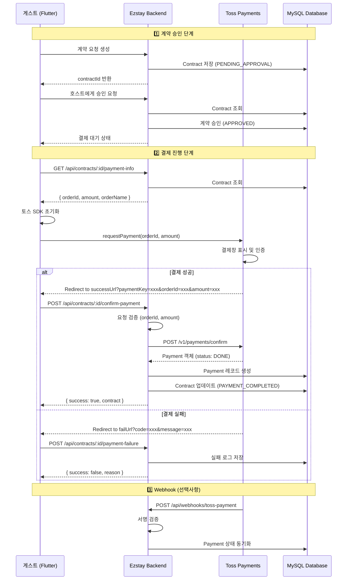

# 🏗️ 토스페이먼츠 결제 시스템 설계

## 📋 목차
1. [개요](#개요)
2. [결제 플로우](#결제-플로우)
3. [데이터베이스 설계](#데이터베이스-설계)
4. [API 설계](#api-설계)
5. [환경 설정](#환경-설정)
6. [보안 고려사항](#보안-고려사항)
7. [에러 처리](#에러-처리)
8. [구현 체크리스트](#구현-체크리스트)

---

## 개요

### 결제 시나리오
```
1. 게스트가 계약 요청 생성 (status: PENDING_APPROVAL)
2. 호스트가 계약 승인 (status: APPROVED) ← 결제 대기 상태
3. 게스트가 결제 진행 (토스페이먼츠)
4. 결제 완료 후 서버 검증
5. 계약 상태 변경 (status: PAYMENT_COMPLETED)
```

### 토스페이먼츠 특징
- **클라이언트 SDK**: 결제창 호출 (프론트엔드)
- **서버 API**: 결제 승인 및 검증 (백엔드)
- **Webhook**: 결제 상태 변경 알림 (선택사항, 권장)

---

## 결제 플로우

### 🔄 전체 플로우 다이어그램


### 📱 클라이언트 측 (Flutter)

#### 1. 결제 정보 조회
```dart
// 계약 승인 후 결제 정보 가져오기
final response = await http.get(
  Uri.parse('$baseUrl/api/contracts/$contractId/payment-info'),
  headers: {'Authorization': 'Bearer $accessToken'}
);

final paymentInfo = jsonDecode(response.body)['data'];
// { orderId, amount, orderName, customerEmail, customerName }
```

#### 2. 토스 SDK 초기화 및 결제 요청
```dart
// pubspec.yaml에 tosspayments_flutter 추가 (또는 WebView 사용)
import 'package:tosspayments_flutter/tosspayments_flutter.dart';

final tossPayments = TossPayments(clientKey: TOSS_CLIENT_KEY);

try {
  await tossPayments.requestPayment(
    method: PaymentMethod.card,
    amount: paymentInfo['amount'],
    orderId: paymentInfo['orderId'],
    orderName: paymentInfo['orderName'],
    successUrl: '$baseUrl/success', // 백엔드 리다이렉트 URL
    failUrl: '$baseUrl/fail',
    customerEmail: paymentInfo['customerEmail'],
    customerName: paymentInfo['customerName'],
  );
} catch (e) {
  // 결제 취소 또는 에러 처리
}
```

#### 3. successUrl 처리 (WebView에서 리다이렉트 감지)
```dart
// WebView에서 successUrl로 리다이렉트되면 query params 추출
// successUrl: /success?paymentKey=xxx&orderId=xxx&amount=xxx

NavigationDecision handleNavigationRequest(NavigationRequest request) {
  final uri = Uri.parse(request.url);

  if (uri.path == '/success') {
    final paymentKey = uri.queryParameters['paymentKey'];
    final orderId = uri.queryParameters['orderId'];
    final amount = uri.queryParameters['amount'];

    // 백엔드로 결제 승인 요청
    confirmPayment(contractId, paymentKey, orderId, amount);
    return NavigationDecision.prevent;
  }

  if (uri.path == '/fail') {
    final code = uri.queryParameters['code'];
    final message = uri.queryParameters['message'];
    showPaymentFailedDialog(code, message);
    return NavigationDecision.prevent;
  }

  return NavigationDecision.navigate;
}

Future<void> confirmPayment(int contractId, String paymentKey, String orderId, int amount) async {
  final response = await http.post(
    Uri.parse('$baseUrl/api/contracts/$contractId/confirm-payment'),
    headers: {
      'Authorization': 'Bearer $accessToken',
      'Content-Type': 'application/json'
    },
    body: jsonEncode({
      'paymentKey': paymentKey,
      'orderId': orderId,
      'amount': amount
    })
  );

  if (response.statusCode == 200) {
    // 결제 완료 → 계약 상세 페이지로 이동
    navigateToContractDetail(contractId);
  } else {
    // 결제 승인 실패 처리
    showError(response.body);
  }
}
```

### 🖥️ 서버 측 (Node.js/Express)

#### 1. 결제 정보 조회 API
```javascript
// controllers/contractController.js

/**
 * 결제 정보 조회 (게스트가 결제하기 전에 호출)
 * GET /api/contracts/:contractId/payment-info
 */
const getPaymentInfo = async (req, res) => {
  try {
    const { contractId } = req.params;
    const guestId = req.user.id;

    // 계약 조회 (게스트 본인 확인)
    const contract = await Contract.findOne({
      where: { id: contractId, guestId },
      include: [
        { model: Room, as: 'room', attributes: ['roomName'] },
        { model: User, as: 'guest', attributes: ['name', 'email'] }
      ]
    });

    if (!contract) {
      return error(res, { code: 3005, message: '계약을 찾을 수 없습니다' }, 404);
    }

    // APPROVED 상태인지 확인 (결제 대기 중인 경우만)
    if (contract.status !== 'APPROVED') {
      return error(
        res,
        {
          code: 4601,
          message: '결제 가능한 상태가 아닙니다',
          currentStatus: contract.status
        },
        400
      );
    }

    // 결제 정보 반환
    return success(res, {
      orderId: contract.orderId,
      amount: contract.finalTotalAmount,
      orderName: `${contract.room.roomName} ${contract.totalDays}박`,
      customerEmail: contract.guest.email,
      customerName: contract.guest.name,
      contractId: contract.id
    }, '결제 정보 조회 성공');

  } catch (err) {
    console.error('결제 정보 조회 오류:', err);
    return error(res, ErrorCodes.INTERNAL_ERROR, 500);
  }fffff
};
```

#### 2. 결제 승인 API (핵심)
```javascript
// controllers/contractController.js
const axios = require('axios');

/**
 * 결제 승인 및 검증
 * POST /api/contracts/:contractId/confirm-payment
 */
const confirmPayment = async (req, res) => {
  const transaction = await sequelize.transaction();

  try {
    const { contractId } = req.params;
    const { paymentKey, orderId, amount } = req.body;
    const guestId = req.user.id;

    // 1. 필수 파라미터 검증
    if (!paymentKey || !orderId || !amount) {
      await transaction.rollback();
      return error(res, ErrorCodes.MISSING_REQUIRED_FIELDS, 400);
    }

    // 2. 계약 조회 (게스트 본인 확인)
    const contract = await Contract.findOne({
      where: { id: contractId, guestId },
      transaction
    });

    if (!contract) {
      await transaction.rollback();
      return error(res, { code: 3005, message: '계약을 찾을 수 없습니다' }, 404);
    }

    // 3. 계약 상태 확인 (APPROVED만 결제 가능)
    if (contract.status !== 'APPROVED') {
      await transaction.rollback();
      return error(
        res,
        {
          code: 4602,
          message: '이미 결제된 계약이거나 결제 가능한 상태가 아닙니다',
          currentStatus: contract.status
        },
        400
      );
    }

    // 4. orderId 및 금액 검증 (변조 방지)
    if (contract.orderId !== orderId) {
      await transaction.rollback();
      return error(
        res,
        { code: 4603, message: '주문번호가 일치하지 않습니다' },
        400
      );
    }

    if (contract.finalTotalAmount !== parseInt(amount, 10)) {
      await transaction.rollback();
      return error(
        res,
        {
          code: 4604,
          message: '결제 금액이 일치하지 않습니다',
          expectedAmount: contract.finalTotalAmount,
          receivedAmount: amount
        },
        400
      );
    }

    // 5. 토스페이먼츠 승인 API 호출
    const tossSecretKey = process.env.TOSS_SECRET_KEY;
    const encodedKey = Buffer.from(`${tossSecretKey}:`).toString('base64');

    let tossResponse;
    try {
      tossResponse = await axios.post(
        'https://api.tosspayments.com/v1/payments/confirm',
        {
          paymentKey,
          orderId,
          amount: parseInt(amount, 10)
        },
        {
          headers: {
            Authorization: `Basic ${encodedKey}`,
            'Content-Type': 'application/json'
          }
        }
      );
    } catch (tossError) {
      await transaction.rollback();
      console.error('토스 결제 승인 실패:', tossError.response?.data || tossError.message);

      return error(
        res,
        {
          code: 4605,
          message: '결제 승인에 실패했습니다',
          tossError: tossError.response?.data?.message || tossError.message
        },
        400
      );
    }

    const paymentData = tossResponse.data;

    // 6. Payment 레코드 생성
    const { Payment } = require('../models');
    const payment = await Payment.create({
      contractId: contract.id,
      paymentKey,
      orderId,
      method: paymentData.method,
      status: paymentData.status,
      requestedAt: new Date(paymentData.requestedAt),
      approvedAt: new Date(paymentData.approvedAt),
      totalAmount: paymentData.totalAmount,
      balanceAmount: paymentData.balanceAmount,
      suppliedAmount: paymentData.suppliedAmount,
      vat: paymentData.vat,
      taxFreeAmount: paymentData.taxFreeAmount,
      currency: paymentData.currency,
      receiptUrl: paymentData.receipt?.url || null,
      paymentResponse: paymentData // 전체 응답 JSON 저장
    }, { transaction });

    // 7. Contract 업데이트 (결제 완료 상태로 변경)
    await contract.update({
      status: 'PAYMENT_COMPLETED',
      paymentMethod: paymentData.method,
      paidAt: new Date(paymentData.approvedAt)
    }, { transaction });

    // 8. 상태 변경 로그 기록
    await ContractStatusLog.createLog({
      contractId: contract.id,
      fromStatus: 'APPROVED',
      toStatus: 'PAYMENT_COMPLETED',
      changedBy: 'GUEST',
      changedByUserId: guestId,
      reason: '게스트가 결제를 완료했습니다',
      metadata: {
        paymentKey,
        paymentMethod: paymentData.method,
        totalAmount: paymentData.totalAmount,
        approvedAt: paymentData.approvedAt
      },
      req,
      transaction
    });

    // 9. 채팅방에 시스템 메시지 발송
    const chatRoom = await ChatRoom.findOne({
      where: { contractId },
      transaction
    });

    if (chatRoom) {
      sendSystemMessage(
        chatRoom.firebaseChatRoomId,
        getSystemMessageTemplate(SystemMessageTypes.PAYMENT_COMPLETED, {
          amount: contract.finalTotalAmount.toLocaleString()
        }),
        SystemMessageTypes.PAYMENT_COMPLETED,
        {
          contractId: contract.id,
          paymentKey,
          totalAmount: contract.finalTotalAmount
        }
      ).catch(err => {
        console.error('시스템 메시지 발송 실패 (결제 완료는 성공):', err);
      });
    }

    await transaction.commit();

    return success(
      res,
      {
        contractId: contract.id,
        orderId: contract.orderId,
        status: contract.status,
        statusLabel: Contract.STATUS_LABELS[contract.status],
        payment: {
          paymentKey: payment.paymentKey,
          method: payment.method,
          status: payment.status,
          totalAmount: payment.totalAmount,
          approvedAt: payment.approvedAt,
          receiptUrl: payment.receiptUrl
        },
        paidAt: contract.paidAt
      },
      '결제가 완료되었습니다'
    );

  } catch (err) {
    await transaction.rollback();
    console.error('결제 승인 오류:', err);
    return error(res, ErrorCodes.INTERNAL_ERROR, 500);
  }
};
```

#### 3. 결제 실패 처리 API
```javascript
/**
 * 결제 실패 로그 저장
 * POST /api/contracts/:contractId/payment-failure
 */
const recordPaymentFailure = async (req, res) => {
  try {
    const { contractId } = req.params;
    const { code, message } = req.body;
    const guestId = req.user.id;

    // 계약 조회
    const contract = await Contract.findOne({
      where: { id: contractId, guestId }
    });

    if (!contract) {
      return error(res, { code: 3005, message: '계약을 찾을 수 없습니다' }, 404);
    }

    // 실패 로그 저장
    const { PaymentFailureLog } = require('../models');
    await PaymentFailureLog.create({
      contractId: contract.id,
      failureCode: code,
      failureMessage: message,
      failedAt: new Date()
    });

    // 상태 로그 기록 (선택사항)
    await ContractStatusLog.createLog({
      contractId: contract.id,
      fromStatus: contract.status,
      toStatus: contract.status, // 상태 변경 없음
      changedBy: 'GUEST',
      changedByUserId: guestId,
      reason: `결제 실패: ${code} - ${message}`,
      metadata: {
        failureCode: code,
        failureMessage: message
      },
      req
    });

    return success(res, { logged: true }, '결제 실패 정보가 기록되었습니다');

  } catch (err) {
    console.error('결제 실패 로그 저장 오류:', err);
    return error(res, ErrorCodes.INTERNAL_ERROR, 500);
  }
};
```

#### 4. Webhook 처리 (선택사항, 권장)
```javascript
// controllers/webhookController.js

/**
 * 토스페이먼츠 Webhook 수신
 * POST /api/webhooks/toss-payment
 */
const handleTossPaymentWebhook = async (req, res) => {
  try {
    const { eventType, data } = req.body;

    // 1. Webhook 서명 검증 (보안 강화)
    const signature = req.headers['toss-webhook-signature'];
    if (!verifyTossWebhookSignature(req.rawBody, signature)) {
      console.error('Webhook 서명 검증 실패');
      return res.status(401).json({ message: 'Unauthorized' });
    }

    // 2. 이벤트 타입별 처리
    switch (eventType) {
      case 'PAYMENT_STATUS_CHANGED':
        await handlePaymentStatusChange(data);
        break;
      case 'VIRTUAL_ACCOUNT_ISSUED':
        await handleVirtualAccountIssued(data);
        break;
      case 'VIRTUAL_ACCOUNT_DEPOSIT':
        await handleVirtualAccountDeposit(data);
        break;
      default:
        console.log(`처리되지 않은 이벤트 타입: ${eventType}`);
    }

    // 3. 200 OK 응답 필수 (토스페이먼츠 재전송 방지)
    return res.status(200).json({ received: true });

  } catch (err) {
    console.error('Webhook 처리 오류:', err);
    return res.status(500).json({ message: 'Internal Server Error' });
  }
};

// Webhook 서명 검증 (HMAC-SHA256)
function verifyTossWebhookSignature(rawBody, signature) {
  const crypto = require('crypto');
  const secret = process.env.TOSS_WEBHOOK_SECRET;
  const hash = crypto
    .createHmac('sha256', secret)
    .update(rawBody)
    .digest('base64');
  return hash === signature;
}

// 결제 상태 변경 처리
async function handlePaymentStatusChange(data) {
  const { paymentKey, orderId, status } = data;

  const { Payment } = require('../models');
  const payment = await Payment.findOne({ where: { paymentKey } });

  if (payment) {
    await payment.update({ status });
    console.log(`Payment ${paymentKey} 상태 업데이트: ${status}`);
  }
}

module.exports = {
  handleTossPaymentWebhook
};
```

---

## 데이터베이스 설계

### 📦 새 모델: Payment (결제 정보)

```javascript
// models/Payment.js
const { DataTypes, Sequelize } = require('sequelize');

const sequelize = new Sequelize('ezstay', process.env.DB_USER || 'root', process.env.DB_PASSWORD || '', {
  host: process.env.DB_HOST || 'localhost',
  port: process.env.DB_PORT || 3306,
  dialect: 'mysql',
  timezone: '+09:00',
  dialectOptions: {
    timezone: '+09:00'
  },
  logging: false
});

/**
 * Payment 모델 - 결제 정보
 * 토스페이먼츠 결제 승인 후 응답 데이터 저장
 */
const Payment = sequelize.define('Payment', {
  id: {
    type: DataTypes.INTEGER,
    primaryKey: true,
    autoIncrement: true
  },
  contractId: {
    type: DataTypes.INTEGER,
    allowNull: false,
    unique: true,
    field: 'contract_id',
    comment: '계약 ID (1:1 관계)'
  },

  // 토스페이먼츠 식별자
  paymentKey: {
    type: DataTypes.STRING(200),
    allowNull: false,
    unique: true,
    field: 'payment_key',
    comment: '토스페이먼츠 결제 고유 키'
  },
  orderId: {
    type: DataTypes.STRING(64),
    allowNull: false,
    field: 'order_id',
    comment: '주문 번호 (Contract.orderId와 동일)'
  },

  // 결제 수단 및 상태
  method: {
    type: DataTypes.STRING(20),
    allowNull: false,
    comment: '결제 수단 (CARD, TRANSFER, VIRTUAL_ACCOUNT, MOBILE_PHONE, etc.)'
  },
  status: {
    type: DataTypes.ENUM(
      'READY',              // 결제 대기
      'IN_PROGRESS',        // 결제 진행중
      'WAITING_FOR_DEPOSIT',// 가상계좌 입금 대기
      'DONE',               // 결제 완료
      'CANCELED',           // 결제 취소
      'PARTIAL_CANCELED',   // 부분 취소
      'ABORTED',            // 결제 승인 실패
      'EXPIRED'             // 결제 만료
    ),
    allowNull: false,
    defaultValue: 'READY',
    comment: '결제 상태'
  },

  // 결제 시점 정보
  requestedAt: {
    type: DataTypes.DATE,
    allowNull: false,
    field: 'requested_at',
    comment: '결제 요청 시각 (토스에서 제공)'
  },
  approvedAt: {
    type: DataTypes.DATE,
    allowNull: true,
    field: 'approved_at',
    comment: '결제 승인 시각 (토스에서 제공)'
  },

  // 금액 정보 (원화 기준)
  totalAmount: {
    type: DataTypes.INTEGER,
    allowNull: false,
    field: 'total_amount',
    comment: '총 결제 금액',
    validate: {
      min: 0
    }
  },
  balanceAmount: {
    type: DataTypes.INTEGER,
    allowNull: true,
    field: 'balance_amount',
    comment: '취소 가능 금액',
    validate: {
      min: 0
    }
  },
  suppliedAmount: {
    type: DataTypes.INTEGER,
    allowNull: true,
    field: 'supplied_amount',
    comment: '공급가액 (VAT 제외)',
    validate: {
      min: 0
    }
  },
  vat: {
    type: DataTypes.INTEGER,
    allowNull: true,
    comment: '부가세',
    validate: {
      min: 0
    }
  },
  taxFreeAmount: {
    type: DataTypes.INTEGER,
    allowNull: true,
    defaultValue: 0,
    field: 'tax_free_amount',
    comment: '면세 금액',
    validate: {
      min: 0
    }
  },

  // 통화
  currency: {
    type: DataTypes.STRING(3),
    allowNull: false,
    defaultValue: 'KRW',
    comment: '통화 (KRW, USD, etc.)'
  },

  // 영수증 URL
  receiptUrl: {
    type: DataTypes.STRING(500),
    allowNull: true,
    field: 'receipt_url',
    comment: '영수증 URL'
  },

  // 토스페이먼츠 전체 응답 JSON (분쟁 대비)
  paymentResponse: {
    type: DataTypes.TEXT,
    allowNull: true,
    field: 'payment_response',
    comment: '토스 Payment 객체 전체 (JSON)',
    get() {
      const rawValue = this.getDataValue('paymentResponse');
      return rawValue ? JSON.parse(rawValue) : null;
    },
    set(value) {
      this.setDataValue('paymentResponse', value ? JSON.stringify(value) : null);
    }
  },

  // 취소 정보 (부분 취소 가능)
  canceledAmount: {
    type: DataTypes.INTEGER,
    allowNull: true,
    defaultValue: 0,
    field: 'canceled_amount',
    comment: '취소된 금액',
    validate: {
      min: 0
    }
  },
  cancelReason: {
    type: DataTypes.TEXT,
    allowNull: true,
    field: 'cancel_reason',
    comment: '취소 사유'
  },
  canceledAt: {
    type: DataTypes.DATE,
    allowNull: true,
    field: 'canceled_at',
    comment: '취소 시각'
  },

  createdAt: {
    type: DataTypes.DATE,
    allowNull: false,
    defaultValue: DataTypes.NOW,
    field: 'created_at'
  },
  updatedAt: {
    type: DataTypes.DATE,
    allowNull: false,
    defaultValue: DataTypes.NOW,
    field: 'updated_at'
  }
}, {
  tableName: 'payments',
  timestamps: true,
  underscored: false,
  indexes: [
    {
      unique: true,
      fields: ['payment_key'],
      name: 'idx_payment_key'
    },
    {
      fields: ['contract_id'],
      name: 'idx_contract_id'
    },
    {
      fields: ['order_id'],
      name: 'idx_order_id'
    },
    {
      fields: ['status'],
      name: 'idx_status'
    },
    {
      fields: ['method'],
      name: 'idx_method'
    },
    {
      fields: ['approved_at'],
      name: 'idx_approved_at'
    }
  ]
});

/**
 * 결제 상태 한글명 매핑
 */
Payment.STATUS_LABELS = {
  READY: '결제 대기',
  IN_PROGRESS: '결제 진행중',
  WAITING_FOR_DEPOSIT: '입금 대기',
  DONE: '결제 완료',
  CANCELED: '결제 취소',
  PARTIAL_CANCELED: '부분 취소',
  ABORTED: '결제 실패',
  EXPIRED: '결제 만료'
};

/**
 * 결제 수단 한글명 매핑
 */
Payment.METHOD_LABELS = {
  CARD: '카드',
  TRANSFER: '계좌이체',
  VIRTUAL_ACCOUNT: '가상계좌',
  MOBILE_PHONE: '휴대폰',
  GIFT_CERTIFICATE: '상품권',
  EASY_PAY: '간편결제'
};

module.exports = Payment;
```

### 📦 새 모델: PaymentFailureLog (결제 실패 로그)

```javascript
// models/PaymentFailureLog.js
const { DataTypes, Sequelize } = require('sequelize');

const sequelize = new Sequelize('ezstay', process.env.DB_USER || 'root', process.env.DB_PASSWORD || '', {
  host: process.env.DB_HOST || 'localhost',
  port: process.env.DB_PORT || 3306,
  dialect: 'mysql',
  timezone: '+09:00',
  dialectOptions: {
    timezone: '+09:00'
  },
  logging: false
});

/**
 * PaymentFailureLog 모델 - 결제 실패 기록
 * 고객이 결제창에서 취소하거나 오류 발생 시 기록
 */
const PaymentFailureLog = sequelize.define('PaymentFailureLog', {
  id: {
    type: DataTypes.INTEGER,
    primaryKey: true,
    autoIncrement: true
  },
  contractId: {
    type: DataTypes.INTEGER,
    allowNull: false,
    field: 'contract_id',
    comment: '계약 ID'
  },
  failureCode: {
    type: DataTypes.STRING(50),
    allowNull: false,
    field: 'failure_code',
    comment: '실패 코드 (토스페이먼츠 에러 코드)'
  },
  failureMessage: {
    type: DataTypes.TEXT,
    allowNull: false,
    field: 'failure_message',
    comment: '실패 메시지'
  },
  failedAt: {
    type: DataTypes.DATE,
    allowNull: false,
    field: 'failed_at',
    comment: '실패 시각'
  },
  createdAt: {
    type: DataTypes.DATE,
    allowNull: false,
    defaultValue: DataTypes.NOW,
    field: 'created_at'
  }
}, {
  tableName: 'payment_failure_logs',
  timestamps: true,
  updatedAt: false,
  underscored: false,
  indexes: [
    {
      fields: ['contract_id'],
      name: 'idx_contract_id'
    },
    {
      fields: ['failed_at'],
      name: 'idx_failed_at'
    }
  ]
});

module.exports = PaymentFailureLog;
```

### 🔗 모델 관계 설정 (models/index.js에 추가)

```javascript
// models/index.js에 추가

const Payment = require('./Payment');
const PaymentFailureLog = require('./PaymentFailureLog');

// Contract - Payment 관계 (1:1)
Contract.hasOne(Payment, {
  foreignKey: 'contractId',
  as: 'payment'
});
Payment.belongsTo(Contract, {
  foreignKey: 'contractId',
  as: 'contract'
});

// Contract - PaymentFailureLog 관계 (1:N)
Contract.hasMany(PaymentFailureLog, {
  foreignKey: 'contractId',
  as: 'paymentFailureLogs'
});
PaymentFailureLog.belongsTo(Contract, {
  foreignKey: 'contractId',
  as: 'contract'
});

module.exports = {
  // ... 기존 모델들
  Payment,
  PaymentFailureLog
};
```

---

## API 설계

### 📡 라우트 설정

```javascript
// routes/contractRoutes.js에 추가

const {
  getPaymentInfo,
  confirmPayment,
  recordPaymentFailure
} = require('../controllers/contractController');

/**
 * 💳 결제 관련 API
 */
// 결제 정보 조회
router.get('/:contractId/payment-info', authenticateToken, getPaymentInfo);

// 결제 승인 및 검증
router.post('/:contractId/confirm-payment', authenticateToken, confirmPayment);

// 결제 실패 기록
router.post('/:contractId/payment-failure', authenticateToken, recordPaymentFailure);
```

```javascript
// routes/webhookRoutes.js (새로 생성)

const express = require('express');
const router = express.Router();
const { handleTossPaymentWebhook } = require('../controllers/webhookController');

// Raw body 파싱 필요 (서명 검증용)
router.post('/toss-payment', express.raw({ type: 'application/json' }), handleTossPaymentWebhook);

module.exports = router;
```

```javascript
// server.js에 추가

const webhookRoutes = require('./routes/webhookRoutes');
app.use('/api/webhooks', webhookRoutes);
```

### 📝 시스템 메시지 타입 추가

```javascript
// utils/systemMessageTypes.js에 추가

SystemMessageTypes: {
  // ... 기존 타입들
  PAYMENT_COMPLETED: 'PAYMENT_COMPLETED',
}

function getSystemMessageTemplate(type, params = {}) {
  switch (type) {
    // ... 기존 케이스들

    case SystemMessageTypes.PAYMENT_COMPLETED:
      return `💳 결제가 완료되었습니다.\n결제 금액: ${params.amount}원\n숙박이 확정되었습니다.`;
  }
}
```

---

## 환경 설정

### 🔑 환경변수 (.env에 추가)

```env
# Toss Payments 설정
TOSS_CLIENT_KEY=test_ck_your_client_key  # 클라이언트 키 (프론트엔드용)
TOSS_SECRET_KEY=test_sk_your_secret_key  # 시크릿 키 (서버용, ⚠️ 외부 노출 금지)
TOSS_WEBHOOK_SECRET=your_webhook_secret  # Webhook 서명 검증용 (선택사항)

# 결제 성공/실패 리다이렉트 URL (프론트엔드 딥링크 또는 WebView URL)
PAYMENT_SUCCESS_URL=http://localhost:3000/success
PAYMENT_FAIL_URL=http://localhost:3000/fail
```

### 🛡️ 환경변수 검증 (server.js에 추가)

```javascript
// server.js 시작 부분에 추가

// 필수 환경변수 검증
const requiredEnvVars = ['TOSS_CLIENT_KEY', 'TOSS_SECRET_KEY'];
requiredEnvVars.forEach(varName => {
  if (!process.env[varName]) {
    console.error(`❌ 환경변수 ${varName}가 설정되지 않았습니다.`);
    process.exit(1);
  }
});

// 시크릿 키 길이 검증 (최소 32자)
if (process.env.TOSS_SECRET_KEY.length < 32) {
  console.error(`❌ TOSS_SECRET_KEY는 최소 32자 이상이어야 합니다.`);
  process.exit(1);
}

console.log('✅ 토스페이먼츠 환경변수 검증 완료');
```

---

## 보안 고려사항

### 🔒 1. 시크릿 키 보호
- **절대 클라이언트에 노출 금지**: `TOSS_SECRET_KEY`는 서버에서만 사용
- **Git 저장소에 커밋 금지**: `.gitignore`에 `.env` 포함
- **환경변수로만 관리**: 코드에 하드코딩 금지

### 🔒 2. 금액 검증 (필수)
```javascript
// 클라이언트에서 전달받은 금액과 DB의 금액 비교
if (contract.finalTotalAmount !== parseInt(amount, 10)) {
  throw new Error('금액 불일치 - 결제 차단');
}
```

### 🔒 3. orderId 검증 (필수)
```javascript
// 클라이언트에서 전달받은 주문번호와 DB의 주문번호 비교
if (contract.orderId !== orderId) {
  throw new Error('주문번호 불일치 - 결제 차단');
}
```

### 🔒 4. 결제 중복 방지
```javascript
// 이미 결제된 계약인지 확인
if (contract.status !== 'APPROVED') {
  throw new Error('이미 결제된 계약이거나 결제 가능한 상태가 아닙니다');
}
```

### 🔒 5. Webhook 서명 검증 (권장)
```javascript
// HMAC-SHA256 서명 검증
function verifyTossWebhookSignature(rawBody, signature) {
  const crypto = require('crypto');
  const secret = process.env.TOSS_WEBHOOK_SECRET;
  const hash = crypto.createHmac('sha256', secret).update(rawBody).digest('base64');
  return hash === signature;
}
```

### 🔒 6. HTTPS 사용 (프로덕션 필수)
- successUrl, failUrl, webhook URL은 모두 HTTPS 사용
- 토스페이먼츠는 HTTPS가 아닌 URL로 리다이렉트 불가

---

## 에러 처리

### ⚠️ 토스페이먼츠 주요 에러 코드

| 에러 코드 | 의미 | 대응 방법 |
|----------|-----|----------|
| `UNAUTHORIZED_KEY` | 잘못된 API 키 | 환경변수 재확인, Base64 인코딩 확인 |
| `INVALID_REQUEST` | 잘못된 요청 파라미터 | paymentKey, orderId, amount 재확인 |
| `ALREADY_PROCESSED_PAYMENT` | 이미 처리된 결제 | DB 상태 확인 후 중복 방지 |
| `PROVIDER_ERROR` | PG사 오류 | 사용자에게 안내 후 재시도 유도 |
| `EXCEED_MAX_CARD_INSTALLMENT_PLAN` | 할부 개월 초과 | 할부 개월 제한 안내 |

### 🛠️ 에러 응답 구조화

```javascript
// utils/responseHelper.js에 추가

ErrorCodes: {
  // ... 기존 에러 코드들

  // 결제 관련 (46xx)
  PAYMENT_NOT_READY: { code: 4601, message: '결제 가능한 상태가 아닙니다' },
  PAYMENT_ALREADY_COMPLETED: { code: 4602, message: '이미 결제가 완료된 계약입니다' },
  PAYMENT_ORDER_ID_MISMATCH: { code: 4603, message: '주문번호가 일치하지 않습니다' },
  PAYMENT_AMOUNT_MISMATCH: { code: 4604, message: '결제 금액이 일치하지 않습니다' },
  PAYMENT_APPROVAL_FAILED: { code: 4605, message: '결제 승인에 실패했습니다' },
  PAYMENT_PROVIDER_ERROR: { code: 4606, message: 'PG사 오류가 발생했습니다' }
}
```

---

## 구현 체크리스트

### 백엔드
- [ ] `Payment` 모델 생성 및 마이그레이션
- [ ] `PaymentFailureLog` 모델 생성 및 마이그레이션
- [ ] 모델 관계 설정 (`models/index.js`)
- [ ] `getPaymentInfo` API 구현
- [ ] `confirmPayment` API 구현 (핵심)
- [ ] `recordPaymentFailure` API 구현
- [ ] Webhook 엔드포인트 구현 (선택)
- [ ] 환경변수 설정 및 검증
- [ ] 에러 코드 추가
- [ ] 시스템 메시지 타입 추가
- [ ] 라우트 설정

### 프론트엔드 (Flutter)
- [ ] 토스페이먼츠 Flutter SDK 설치 (또는 WebView 준비)
- [ ] 결제 정보 조회 API 호출
- [ ] 결제 SDK 초기화 및 `requestPayment` 호출
- [ ] successUrl 리다이렉트 감지 및 파라미터 추출
- [ ] 결제 승인 API 호출 (`confirmPayment`)
- [ ] failUrl 리다이렉트 처리 및 에러 표시
- [ ] 로딩 상태 및 에러 핸들링 UI

### 테스트
- [ ] 테스트 API 키로 결제 플로우 테스트
- [ ] 금액 변조 시나리오 테스트
- [ ] orderId 불일치 시나리오 테스트
- [ ] 중복 결제 방지 테스트
- [ ] 결제 취소/실패 시나리오 테스트
- [ ] Webhook 수신 테스트 (선택)

### 프로덕션 배포 전
- [ ] 프로덕션 API 키 발급 및 환경변수 설정
- [ ] HTTPS 설정 (successUrl, failUrl, webhook URL)
- [ ] 토스페이먼츠 가맹점 심사 완료
- [ ] 실제 결제 테스트 (소액)
- [ ] 에러 모니터링 및 로깅 설정

---

## 🎯 핵심 요약

### **우리가 PG사(토스페이먼츠)에 줘야 하는 데이터**
1. **결제 요청 시** (클라이언트 → 토스 SDK):
   - `orderId`: 계약 주문번호 (Contract.orderId, 우리가 생성)
   - `amount`: 결제 금액 (Contract.finalTotalAmount)
   - `orderName`: 주문명 (예: "강남 오피스텔 10박")
   - `customerEmail`: 게스트 이메일
   - `customerName`: 게스트 이름
   - `successUrl`: 결제 성공 시 리다이렉트 URL
   - `failUrl`: 결제 실패 시 리다이렉트 URL

2. **결제 승인 시** (백엔드 → 토스 API):
   - `paymentKey`: 토스에서 발급한 결제 고유 키 (successUrl에서 전달받음)
   - `orderId`: 주문번호 (검증용)
   - `amount`: 결제 금액 (검증용)
   - `Authorization`: Basic base64(secretKey:) 헤더

### **우리가 PG사로부터 받아서 저장해야 할 정보**
1. **결제 승인 응답** (`/v1/payments/confirm`):
   - `paymentKey`: 결제 고유 키 (Payment.paymentKey)
   - `orderId`: 주문번호 (검증)
   - `status`: 결제 상태 (DONE, CANCELED 등)
   - `method`: 결제 수단 (CARD, TRANSFER 등)
   - `approvedAt`: 승인 시각
   - `totalAmount`: 총 금액
   - `balanceAmount`: 취소 가능 금액
   - `suppliedAmount`: 공급가액 (VAT 제외)
   - `vat`: 부가세
   - `receiptUrl`: 영수증 URL
   - **전체 응답 JSON**: `paymentResponse` 필드에 저장 (분쟁 대비)

2. **Webhook 이벤트** (선택):
   - `eventType`: 이벤트 타입 (PAYMENT_STATUS_CHANGED 등)
   - `data`: 결제 객체 (Payment 모델 업데이트용)

### **효율적인 구현을 위한 핵심 포인트**
1. ✅ **금액/주문번호 검증 필수**: 클라이언트 변조 방지
2. ✅ **트랜잭션 사용**: 결제 승인 실패 시 롤백
3. ✅ **중복 결제 방지**: Contract.status 확인
4. ✅ **전체 응답 JSON 저장**: 분쟁 시 증빙 자료
5. ✅ **Webhook 구현 권장**: 결제 상태 자동 동기화
6. ✅ **환경변수로 API 키 관리**: 보안 강화

---

**문서 버전**: 1.0
**최종 수정일**: 2025-01-11
**작성자**: Claude Code
